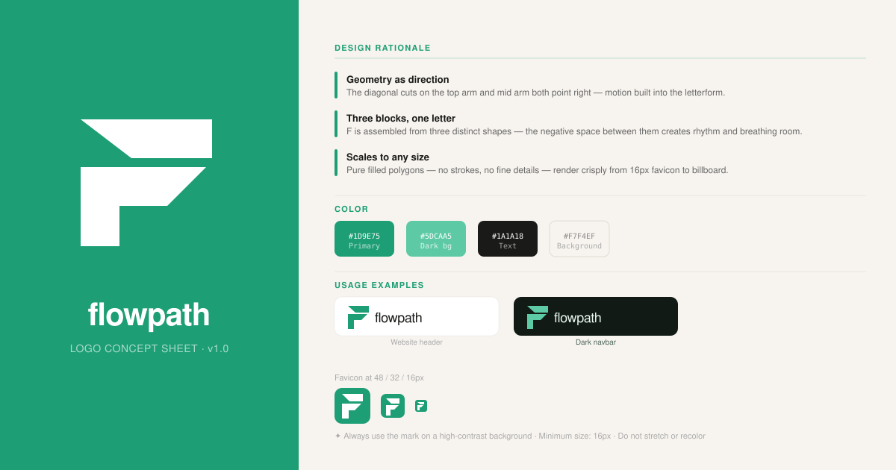
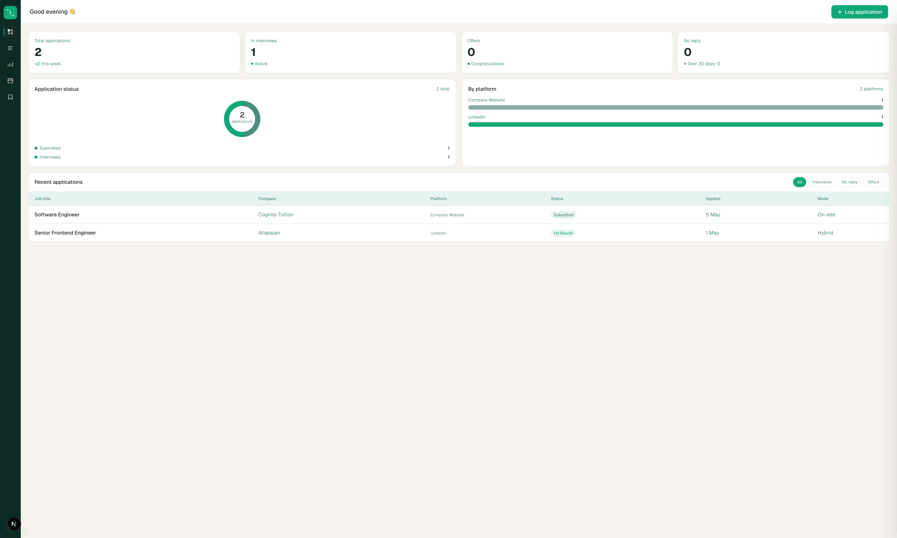

# Flowpath

> Track less. Move forward faster.

---

## Overview

Flowpath is a personal OS for job searching — bringing structure, clarity, and momentum to what is usually a chaotic, spreadsheet-driven process.

Most people manage their job search across a patchwork of tools: a Notion page here, a Google Sheet there, a folder of bookmarked tabs they never revisit. The result is a process that's exhausting to maintain and impossible to reason about. You lose track of where you applied, forget to follow up, and have no idea what's actually working.

Flowpath consolidates all of it into a single, purposeful workspace — so you can spend less time managing the search and more time advancing it.

---

## Why I Built This

I went through a job search and kept reaching for the same makeshift tools everyone else uses. Notion templates that looked great but required constant manual upkeep. Spreadsheets that got unwieldy fast. To-do apps that had no concept of application stages, follow-ups, or response rates.

None of them were built for this workflow. They were general-purpose tools wedged into a specific, structured process — and it showed. I had no visibility into what was working, no way to see patterns, and no system to tell me where to focus next.

A purpose-built tool changes that. When the structure is designed around the workflow, maintenance almost disappears — and insight becomes automatic.

---

## Core Concept: Job Search OS

Flowpath is organized around three activities that make a job search actually work:

- **Track** — every application, status, contact, and deadline in one place. No more reconstructing history from your inbox.
- **Analyze** — understand what's working: which channels are converting, which roles you're getting traction in, which stages you're dropping off at. Search strategy should be data-driven.
- **Plan** — use what you know to decide where to focus next. Calendar view, upcoming deadlines, and momentum indicators keep you moving intentionally.

**On the name:** "Flow" is the psychological state of focused, forward progress — when you're not fighting your tools or second-guessing your process. "Path" means direction and intentionality — knowing where you're headed and why. Together, Flowpath describes exactly what the product tries to produce: a job search that feels purposeful instead of chaotic.

---

## Features

**Dashboard** — your job search at a glance. Status overview, recent activity, upcoming deadlines, and momentum indicators. You always know where you stand without digging through records.

**Applications** — a structured tracker that goes beyond a spreadsheet. Log roles, stages, contacts, notes, and follow-up dates. Filter and sort to surface exactly what needs attention right now.

**Analytics** — turn your search history into insight. See application volume over time, stage conversion rates, response rates by channel, and where you're spending effort vs. getting results.

**Calendar** — interviews, follow-ups, and self-imposed deadlines in a unified view. Never miss a window because it was buried in a different tab.

**Saved Jobs** — capture opportunities before you apply. Research, compare, and decide with full context intact — not just a URL you'll forget about.

---

## Preview




---

## Design Decisions

**Why this UI**
The interface is intentionally minimal. Job searching is already mentally taxing; the tool should reduce cognitive load, not add to it. No dashboards cluttered with metrics you don't need, no settings pages with 40 toggles. Everything is structured around the workflow itself.

**Why the flow concept**
Most trackers are static tables. Flowpath treats a job search as a process with stages, momentum, and direction. The UI reflects this: at any point, you can see where you are in the flow and what logically comes next — not just a frozen snapshot of rows and columns.

**Why Flowpath**
The name carries two meanings: Flow (the psychological state of focused, effortless progress) and Path (direction, intentionality). Together they describe exactly what the product tries to create — a job search that feels like it's moving somewhere, not just being tracked.

---

## Tech Stack

| Layer | Choice |
|---|---|
| Framework | Next.js 16 + React 19 |
| Styling | Tailwind CSS v4 |
| Database | PostgreSQL via Prisma ORM |
| Charts | Recharts |
| Deployment | Vercel |

---

## Future Improvements

- Email parsing to auto-log application confirmations and interview invites
- LinkedIn / job board integration for one-click saving
- Smarter analytics: predicted response rates, best days to apply, role fit scoring
- Reminder system with nudges for follow-ups and stale applications
- AI-generated weekly search summaries

---

## Getting Started

```bash
git clone https://github.com/your-username/flowpath.git
cd flowpath
npm install
cp .env.example .env.local
# fill in your environment variables
npm run dev
```

Then open [http://localhost:3000](http://localhost:3000).
